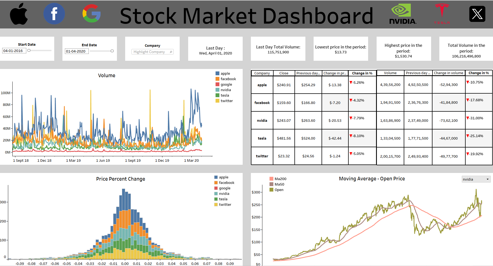

# 📈 Stock Market Dashboard – NASDAQ Data Analysis
Collected historical NASDAQ stock data using Python (yFinance), cleaned and analyzed trends in stock prices and volume, and built an interactive Tableau dashboard for comparing ticker performance over time.

### 🔧 Tools Used
Python (Pandas, yFinance), Tableau, Excel

### 📘 Project Overview
This project analyzes historical stock data of NASDAQ-listed companies retrieved using the `yfinance` Python package. It focuses on understanding stock price trends, trading volumes, and volatility over time. The final output is a Tableau dashboard designed to help users compare multiple tickers interactively.

### 📊 Key Insights
- Tech tickers showed high trading volumes and sharp recovery post-early 2020 dips.
- Average closing prices highlighted consistent performers across sectors.
- Volume spikes aligned with major market or company-specific events.

### 📁 Files Included
- `/nasdaq_data` – Cleaned dataset used for dashboarding  
- `Pandas-Tableau Project.twb` – Tableau packaged workbook file  
- `Pandas-Tableau Project.ipynb` – Python notebook for data extraction & cleaning  
- `Project-Report.pdf` – Full report with insights and visuals  
- `Dashboard-screenshot.png` – Screenshot of dashboard visuals

### 📈 Dashboard Features
- **Line Charts** – Track stock performance over time  
- **Dropdown Filters** – Select and compare specific tickers  
- **KPI Cards** – Avg. price, volume, high/low stats  
- **Interactive Tooltip** – Hover for detailed day-wise values

- ### 🔗 Outputs
- 
- [📄 View Full Report (PDF)](./Project-report.pdf)

